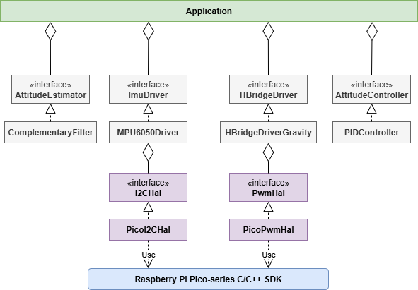

# self-balancing-robot
This project implements a self-balancing two-wheeled robot powered by a Raspberry Pi Pico 2. The robot uses an IMU sensor, state estimation and control in C++ to maintain balance in real time.

## 🎯 Features
* Real-time balance using PID control
* Deterministic loop timing through hardware timer interrupts
* Hardware abstraction using interface classes to enable platform-independent device drivers
* Modular architecture enabling reuse of SW components

## 🏗️ SW Architecture


## 📂 Repository Structure
```
├── drivers/
│   ├── h_bride/        # H bridge drivers for DC motor control
│   ├── hal/            # Hardware abstraction layer for drivers
|   ├── hw_adapter/     # Pico specific HW adapters
│   └── imu/            # IMU drivers
├── src/
|   ├── control/        # State estimation and control module
|   └── app.hpp         # Business logic for main loop
├── CMakeLists.txt      # Main build configuration
└── README.md
```

## 🛠️ Hardware
* Raspberry Pi Pico 2
* MPU6050 IMU
* 2 x DC gear motor, driver & wheels
* Power source